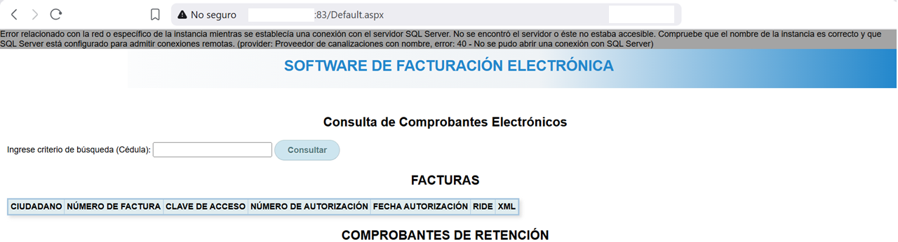

# Information Disclosure and Environment Exposure in Public Services Portal

## 📝 Executive Summary
During a passive reconnaissance phase focused on analyzing citizen service platforms, a critical infrastructure exposure was identified in an electronic invoicing web portal belonging to a public sector entity. The system exposes detailed database engine error messages, operates on a non-standard port, and lacks transport layer encryption (HTTPS). This combination significantly elevates the risk of targeted attacks and the interception of sensitive user data.

---

## 🔍 Findings & Reconnaissance Details

### 1. Access Vector & Exposed Architecture
The web application does not utilize standard Domain Name System (DNS) resolution; instead, it is directly accessible via a public IP address on a non-conventional port:

* **Target URL:** `http://X.X.X.X:83/Default.aspx`
* **Protocol:** HTTP (Data in transit via plaintext, lacking TLS/SSL).
* **Frontend Technology:** ASP.NET (identified by the `.aspx` file extension and server headers).

### 2. Anomalous Behavior (Information Disclosure)
When interacting with the internal portal's query fields, the backend failed to handle exceptions properly, deploying a native .NET framework error message instead of a controlled, generic error page:

> **Captured Error Message:**
> *"Error relacionado con la red o específico de la instancia mientras se establecía una conexión con el servidor SQL Server. No se encontró el servidor o éste no estaba accesible. Compruebe que el nombre de la instancia es correcto y que SQL Server está configurado para admitir conexiones remotas. (provider: Proveedor de canalizaciones con nombre, error: 40 - No se pudo abrir una conexión con SQL Server)"*

The next screenshot is a demonstration about the explanation above:



### 📊 Infrastructure Stack Breakdown
Based on the exposed error and URL structure, the exact blueprint of the internal infrastructure was determined:
* **Web Server:** Internet Information Services (IIS) running ASP.NET.
* **Database Management System (DBMS):** Microsoft SQL Server (MSSQL).
* **Internal Communication Mechanism:** Named Pipes.

---

## ⚡ Potential Impact & Risks

1. **Facilitated Reconnaissance:** An external attacker gains precise confirmation of the database engine and web server technology without performing aggressive active scanning. This allows them to search for specific exploits tailored to the exact MSSQL or IIS versions in use.
2. **Exposure of Internal/Staging Environments:** Operating on port `83` strongly suggests that a development, QA, or internal-use application was indexed or published to the internet without proper perimeter access controls (such as Firewalls or WAF rules).
3. **Man-in-the-Middle (MitM) Attacks:** Because the portal operates strictly over HTTP, any credentials, session tokens, or tax/fiscal data queried by citizens can be intercepted in plaintext by third parties on the network.

---

## 🛠️ Remediation & Mitigation Recommendations

### A. Disable Detailed Errors (.NET Hardening)
The application's global configuration file (`web.config`) must be modified to restrict system error visibility to external users, forcing redirection to generic, user-friendly error pages:

```xml
<configuration>
    <system.web>
        <!-- Force detailed errors to be hidden from the general public -->
        <customErrors mode="RemoteOnly" defaultRedirect="~/Errors/GenericError.html"/>
    </system.web>
</configuration>
